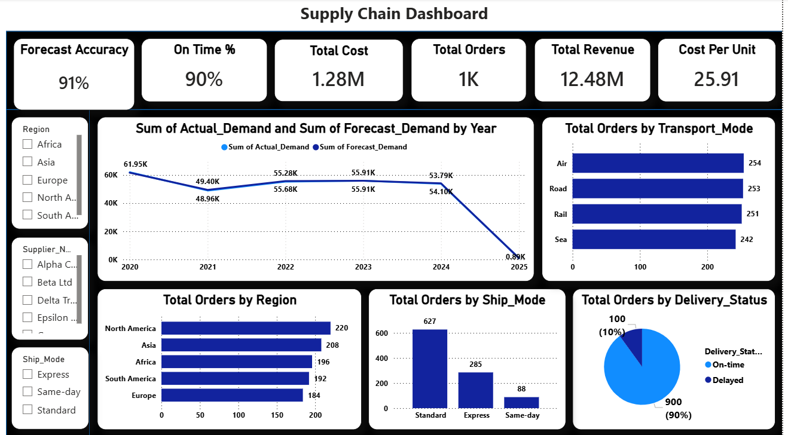

# Supply Chain Analytics Dashboard – Power BI Project

This project is an interactive Supply Chain Analytics Dashboard developed using Power BI to analyze and monitor key supply chain operations through data-driven insights and visual storytelling. The dashboard helps businesses track important metrics related to sales performance, inventory management, order processing, shipping efficiency, supplier performance, and operational productivity.

The main objective of this project is to transform raw supply chain data into meaningful insights that support better business decisions and improve overall operational efficiency. The dashboard provides a centralized view of supply chain activities, enabling users to identify trends, detect bottlenecks, monitor KPIs, and optimize business processes effectively.

The dashboard includes multiple interactive visualizations such as KPI cards, bar charts, line charts, pie charts, and filters that allow users to explore data dynamically. Users can analyze sales trends, monitor inventory levels, evaluate delivery performance, and understand customer demand patterns in real time.

## Key Features

* Interactive and user-friendly Power BI dashboard
* KPI tracking for sales, orders, inventory, profit, and shipping performance
* Dynamic filtering and drill-down analysis
* Supply chain trend analysis and operational monitoring
* Data-driven insights for improved decision-making
* Clean and visually appealing dashboard design

## Key Insights

* Identified top-performing products and categories contributing to maximum revenue
* Analyzed shipping delays and delivery performance across different regions
* Tracked inventory trends to identify stock shortages and overstock situations
* Monitored sales and profit trends over time for business growth analysis
* Evaluated supplier and operational performance to improve efficiency
* Highlighted customer demand patterns and order distribution trends

## Tools & Technologies Used

* Power BI
* DAX (Data Analysis Expressions)
* Data Modeling
* Data Cleaning & Transformation
* Business Intelligence & Data Visualization

This project demonstrates strong skills in data analytics, business intelligence, dashboard development, and visualization techniques. It showcases the ability to convert complex business data into actionable insights and create interactive dashboards that support strategic decision-making.

## Dashboard Preview

